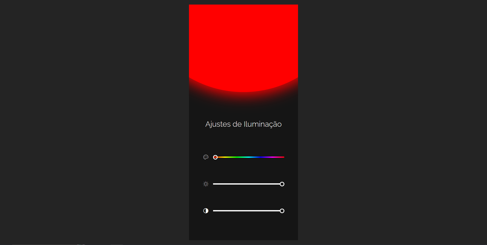

<h1 align="center"> Rgb para devs</h1>

<a href="https://www.rocketseat.com.br/boracodar">#boraCodar</a> são desafios semanais, promovido pela Rocketseat para ensino de tecnologias WEB.  

  <a href="#-tecnologias">Tecnologias</a>&nbsp;&nbsp;&nbsp;|&nbsp;&nbsp;&nbsp;
  <a href="#-layout">Layout</a>&nbsp;&nbsp;&nbsp;|&nbsp;&nbsp;&nbsp;
  <a href="#memo-licença">Licença</a>

  

 

  

## 🚀 Tecnologias

Esse projeto foi desenvolvido com as seguintes tecnologias:

- Html5
- css3
- javaScript
- Git 
- GitHub

## 🔖 Layout

Você pode visualizar o layout do projeto através [DESSE LINK](https://www.figma.com/file/VnorH8lOk3bXOTawsTR1yI/Carrinho-de-compras-•-Desafio-21-(Community)?type=design&node-id=0-1&mode=design&t=8rlSwXgTfuEwBHrX-0). É necessário ter conta no [Figma](https://figma.com) para acessá-lo.

